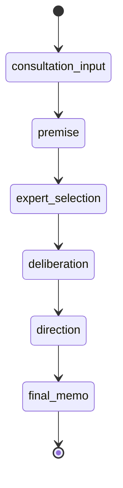

# 状態機械

MVPでは、アプリ側がフェーズ遷移を管理する。LLM は次の候補行動を提案できるが、実際の遷移はアプリ側で決定する。

## フェーズ

| ID | 表示名 | 目的 |
|---|---|---|
| consultation_input | 相談入力 | ユーザーが相談内容を入力する |
| premise | 前提整理 | 事実、希望、不安、不明点を整理する |
| expert_selection | 専門家選定 | 必要な専門家ロールを提案し、ユーザーが編集する |
| deliberation | 検討 | 専門家コメント、論点整理、調査候補の提示を行う |
| direction | 方向性整理 | 判断軸、選択肢、対立点、未確認事項を整理する |
| final_memo | 終了メモ | 暫定結論、保留理由、次アクションを Markdown で出力する |

## 初期遷移

## 割り込み

ユーザーが「ちょっと待って」を押した場合、実行中の LLM 処理は即時キャンセルせず、次の区切りで停止する。

停止後、ファシリテーターは次の選択肢を提示する。

- 前提を修正したい
- この論点を深掘りしたい
- 外部情報を調べたい
- 別の選択肢を追加したい
- いったんまとめたい
- その他

