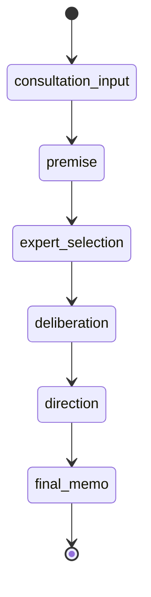

# 状態機械

MVPでは、アプリ側がフェーズ遷移を管理する。LLM は次の候補行動を提案できるが、実際の遷移はアプリ側で決定する。

## フェーズ

| ID                 | 表示名     | 目的                                                   |
| ------------------ | ---------- | ------------------------------------------------------ |
| consultation_input | 相談入力   | ユーザーが相談内容を入力する                           |
| premise            | 前提整理   | 事実、希望、不安、不明点を整理する                     |
| expert_selection   | 専門家選定 | 必要な専門家ロールを提案し、ユーザーが編集する         |
| deliberation       | 検討       | 専門家コメント、論点整理、調査候補の提示を行う         |
| direction          | 方向性整理 | 判断軸、選択肢、対立点、未確認事項を整理する           |
| final_memo         | 終了メモ   | 暫定結論、保留理由、次アクションを Markdown で出力する |

## 初期遷移



## 遷移ルール

状態: `決定`

MVP の基本フローは前進方向のフェーズ遷移とする。ただし、ユーザーは通常操作として前フェーズへ戻れる。

| 現在フェーズ       | 前進先           | 戻れるフェーズ                                           |
| ------------------ | ---------------- | -------------------------------------------------------- |
| consultation_input | premise          | なし                                                     |
| premise            | expert_selection | consultation_input                                       |
| expert_selection   | deliberation     | consultation_input, premise                              |
| deliberation       | direction        | consultation_input, premise, expert_selection            |
| direction          | final_memo       | consultation_input, premise, expert_selection            |
| final_memo         | 終了             | consultation_input, premise, expert_selection, direction |

アプリ側は、現在フェーズより後のフェーズへユーザー操作だけで直接移動させない。後続フェーズへ進む場合は、現在フェーズの完了条件を満たし、必要な LLM 呼び出しまたはユーザー確認が完了している必要がある。

LLM は `next_action` で候補行動を返せるが、実際のフェーズ遷移はアプリ側が決定する。LLM 出力の `current_phase` がアプリ側の現在フェーズまたは許可された遷移と矛盾する場合、アプリ側はその出力を不正として扱う。

## フェーズ完了条件

状態: `決定`

| フェーズ           | 完了条件                                                                           |
| ------------------ | ---------------------------------------------------------------------------------- |
| consultation_input | 必須項目の相談内容が入力されている                                                 |
| premise            | 相談テーマ、事実、希望、不安、不明点が初期整理されている                           |
| expert_selection   | 専門家ロール案をユーザーが承認、追加、削除、入れ替え、またはおまかせで確定している |
| deliberation       | 必要な専門家コメントとファシリテーター整理が生成されている                         |
| direction          | 判断軸、選択肢、対立点、未確認事項、次アクション候補が整理されている               |
| final_memo         | Markdown 終了メモが生成され、ユーザーが保存または終了できる状態になっている        |

## 前フェーズへ戻る操作

状態: `決定`

ユーザーが前フェーズへ戻る場合、アプリは戻り先より後の生成結果を破棄する確認を表示する。戻り先フェーズの入力状態は残し、ユーザーはそのフェーズから操作をやり直せる。

確認文言:

```text
このフェーズに戻ると、以降の整理内容と生成結果は破棄されます。戻りますか？
```

ユーザーが同意した場合のみ、戻り先より後のファシリテーター応答、専門家コメント、セッションメモ更新、終了メモを現在セッションから完全に取り除く。MVP では破棄済み履歴を保持しない。

専門家コメントは `deliberation` の独立履歴として保存しない。`direction` から検討をやり直す場合、ユーザーは `expert_selection` に戻り、保存済みの専門家ロールを編集または再確定してコメント生成を実行する。

`final_memo` から `direction` に戻る場合は、専門家コメントを保持し、終了メモだけを破棄する。

ユーザーが同意しない場合、現在フェーズに留まる。

## 割り込み

ユーザーが「ちょっと待って」を押した場合、実行中の LLM 処理は即時キャンセルせず、次の区切りで停止する。

停止後、ファシリテーターは次の選択肢を提示する。

- 前提を修正したい
- この論点を深掘りしたい
- 外部情報を調べたい
- 別の選択肢を追加したい
- いったんまとめたい
- その他

## `next_action`

状態: `決定`

`next_action` は LLM からアプリへの候補行動であり、フェーズ遷移そのものではない。

| 値              | 意味                         |
| --------------- | ---------------------------- |
| wait_user       | ユーザー回答または操作を待つ |
| request_experts | 専門家コメント生成へ進む候補 |
| update_memo     | セッションメモ更新へ進む候補 |
| move_phase      | 次フェーズへ進む候補         |
| finish          | セッション終了へ進む候補     |

アプリ側は `next_action`、現在フェーズ、完了条件、ユーザー操作を照合して次の処理を決定する。
