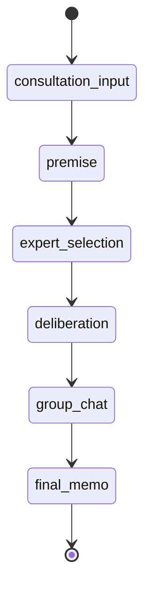

# 状態機械

MVPでは、アプリ側がフェーズ遷移を管理する。LLM は次の候補行動を提案できるが、実際の遷移はアプリ側で決定する。

## フェーズ

| ID                 | 表示名     | 目的                                                           |
| ------------------ | ---------- | -------------------------------------------------------------- |
| consultation_input | 相談入力   | ユーザーが相談内容を入力する                                   |
| premise            | 前提整理   | 事実、希望、不安、不明点を整理する                             |
| expert_selection   | 専門家選定 | 必要な専門家ロールを提案し、ユーザーが編集する                 |
| deliberation       | 案の選択   | 初回の専門家コメントと具体案を表示し、意見交換の起点を選ぶ     |
| group_chat         | 意見交換   | ファシリテーターの指名により、専門家・ユーザーが順番に検討する |
| final_memo         | 終了メモ   | 暫定結論、保留理由、次アクションを Markdown で出力する         |

## 初期遷移



## 遷移ルール

状態: `決定`

MVP の基本フローは前進方向のフェーズ遷移とする。ただし、ユーザーは通常操作として前フェーズへ戻れる。

| 現在フェーズ       | 前進先           | 戻れるフェーズ                                                          |
| ------------------ | ---------------- | ----------------------------------------------------------------------- |
| consultation_input | premise          | なし                                                                    |
| premise            | expert_selection | consultation_input                                                      |
| expert_selection   | deliberation     | consultation_input, premise                                             |
| deliberation       | group_chat       | consultation_input, premise, expert_selection                           |
| group_chat         | final_memo       | consultation_input, premise, expert_selection, deliberation             |
| final_memo         | 終了             | consultation_input, premise, expert_selection, deliberation, group_chat |

アプリ側は、現在フェーズより後のフェーズへユーザー操作だけで直接移動させない。後続フェーズへ進む場合は、現在フェーズの完了条件を満たし、必要な LLM 呼び出しまたはユーザー確認が完了している必要がある。

LLM は `next_action` で候補行動を返せるが、実際のフェーズ遷移はアプリ側が決定する。LLM 出力の `current_phase` がアプリ側の現在フェーズまたは許可された遷移と矛盾する場合、アプリ側はその出力を不正として扱う。

## フェーズ完了条件

状態: `決定`

| フェーズ           | 完了条件                                                                                         |
| ------------------ | ------------------------------------------------------------------------------------------------ |
| consultation_input | 必須項目の相談内容が入力されている                                                               |
| premise            | 初期整理と必須確認質問への回答が完了している                                                     |
| expert_selection   | 専門家ロール案をユーザーが承認、追加、削除、入れ替え、またはおまかせで確定している               |
| deliberation       | 確定済み専門家の初回コメントが全件生成され、ユーザーが1案深掘り・2案比較・保留のいずれかを選べる |
| group_chat         | 完全な案選択を起点に開始され、ユーザーが終了確認で終了状態を選択している                         |
| final_memo         | Markdown 終了メモが生成され、ユーザーが保存または終了できる状態になっている                      |

## 前フェーズへ戻る操作

状態: `決定`

ユーザーが前フェーズへ戻る場合、アプリは戻り先より後の生成結果を破棄する確認を表示する。戻り先フェーズの入力状態は残し、ユーザーはそのフェーズから操作をやり直せる。

確認文言:

```text
このフェーズに戻ると、以降の整理内容と生成結果は破棄されます。戻りますか？
```

ユーザーが同意した場合のみ、戻り先より後のファシリテーター応答、専門家コメント、セッションメモ更新、終了メモを現在セッションから完全に取り除く。MVP では破棄済み履歴を保持しない。

`group_chat` から `deliberation` に戻る場合、アプリはグループチャット履歴と、グループチャット開始後に更新したセッションメモを破棄する。初回専門家コメント、確定済み専門家、案選択は保持し、セッションメモはグループチャット開始時点へ戻す。

保存済みセッションを復元する際、初回専門家コメント、案選択、選択途中の案IDは共有schemaと案ID参照で検証する。旧形式で具体案がない、案IDが重複する、選択が参照先と一致しないなどの場合、アプリはグループチャットを復元または再開しない。確定済み専門家を保持したまま `expert_selection` へ安全に戻し、初回コメントと案選択、グループチャット履歴を破棄する。

保存値が `group_chat` でも、現行schemaを満たす進行ターンを復元できない場合、アプリは空の意見交換画面を表示しない。グループチャットを再開せず `deliberation` へ戻し、保持できる初回専門家コメントと案選択から意見交換の開始をやり直せるようにする。

保存済みのファシリテーター応答が `next_action: wait_user` でも、必須の確認質問を現行形式へ復元できない場合、アプリは操作不能な前提整理画面を表示しない。相談内容を残したまま進行状態を破棄し、`consultation_input` から開始をやり直せるようにする。

`deliberation` から `expert_selection` に戻る場合、アプリは初回専門家コメント、案選択、グループチャット履歴を破棄する。初回コメントを再生成した場合も、以前の案選択は破棄する。

この戻り先で候補を変更せずに「このまま進める」を選んだ場合は、確定済み候補を再利用して初回専門家コメントを再生成し、検討フェーズへ進む。

`final_memo` から `group_chat` に戻る場合は、終了メモだけを破棄する。グループチャット履歴とセッションメモは保持する。

終了メモの自動生成が失敗した場合は、アプリは `group_chat` へ戻る。この失敗復旧では、ユーザーが終了状態を選び直せるよう `SessionMemo.status` を `in_progress` に戻す。

終了メモの生成中に保存済みセッションを復元した場合も、Markdown がなければ自動生成は完了していないものとして扱う。アプリは `group_chat` へ戻り、`SessionMemo.status` を `in_progress` に戻して終了状態を選び直せるようにする。

ユーザーが同意しない場合、現在フェーズに留まる。

## `next_action`

状態: `決定`

`next_action` は LLM からアプリへの候補行動であり、フェーズ遷移そのものではない。

| 値              | 意味                         |
| --------------- | ---------------------------- |
| wait_user       | ユーザー回答または操作を待つ |
| request_experts | 専門家コメント生成へ進む候補 |
| update_memo     | セッションメモ更新へ進む候補 |
| move_phase      | 次フェーズへ進む候補         |
| finish          | セッション終了へ進む候補     |

アプリ側は `next_action`、現在フェーズ、完了条件、ユーザー操作を照合して次の処理を決定する。
